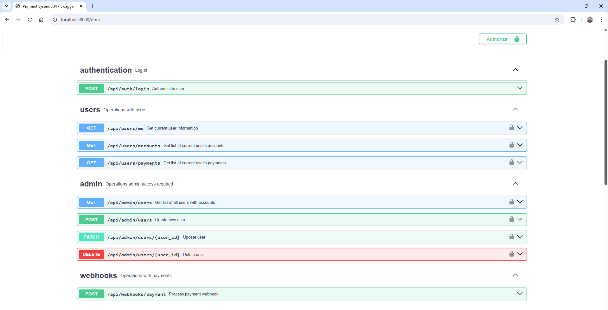

# FastAPI Pay Flow REST API

Асинхронное REST API приложение для интеграции с банковской системой, построенное на FastAPI с использованием PostgreSQL и SQLAlchemy ORM.

## 🚀 Функциональность

### 🔐 Аутентификация и авторизация
- **JWT авторизация** по email/password
- **OAuth 2.0** поддержка стандартной авторизации
- Защищенные эндпоинты с проверкой ролей

### 👤 Пользовательские возможности
- Просмотр информации о своем профиле
- Просмотр своих счетов
- Просмотр истории платежей
- Автоматическое взаимодействие с платежной системой

### 👨‍💼 Административные функции
- Создание новых пользователей
- Редактирование и удаление пользователей
- Просмотр всех пользователей с информацией о счетах и балансах

### 💳 Платежная интеграция
- Обработчик вебхуков от сторонней платежной системы
- Безопасная обработка транзакций
- Интеграция с внешними платежными провайдерами

### 📖 Документация
- Полное документирование API через Swagger UI

## 📦 Установка и запуск

### Клонирование репозитория
```bash
git clone <repository-url>
cd <project-directory>
```

### Конфигурация
Переименуйте файл `.env.example` в `.env` и заполните его актуальными данными

### Запуск приложения через `docker-compose`
#### Предварительные требования
- Docker
- Docker Compose
- Git

```bash
# Запуск в development режиме (с автоматическими миграциями)
ENVIRONMENT=development docker-compose up --build

# Или для production режима
ENVIRONMENT=production docker-compose up --build
```

#### Остановка приложения
```bash
docker-compose down
```

### Локальный запуск приложения
#### Предварительные требования
- Python 3.10+
- PostgreSQL 12+
- pip (менеджер пакетов Python)
- virtualenv (рекомендуется)

#### Создание виртуального окружения
```bash
# Создание виртуального окружения
python -m venv venv

# Активация для Linux/macOS
source venv/bin/activate

# Активация для Windows
venv\Scripts\activate
```
#### Установка зависимостей
```bash
pip install -r requirements.txt
```
#### Настройка базы данных PostgreSQL
```bash
sudo -u postgres psql
CREATE DATABASE pay_flow_db;
CREATE USER your_user WITH PASSWORD 'your_password';
GRANT ALL PRIVILEGES ON DATABASE pay_flow_db TO your_user;
\q
```
#### Запуск приложения через Uvicorn
```bash
uvicorn app.main:app --reload --host 0.0.0.0 --port 8000
```

## 📚 Использование

### Миграции базы данных

В режиме `development` при запуске приложения автоматически применяются миграции Alembic и создаются тестовые данные:

- Тестовые пользователи:

Test User: test_user@example.com / test_user_password (роль: USER, id: 1)  
Test Admin: test_admin@example.com / test_admin_password (роль: ADMIN, id: 2)

- Тестовые счета: Создается один тестовый счет привязанный к Test User

### Документация и тестирование API

После запуска приложения документация и тестирование доступно по адресу:

- Swagger UI: http://localhost:8000/docs

<p align="center"></p>

### Аутентификация

- Получите JWT токен через `/api/auth/login` или OAuth 2.0
- Фронтенд должен добавлять токен в заголовок каждого запроса

## 🏗️ Структура проекта
```
src/
├── alembic/           # Миграции Alembic
├── app/
│   ├── api/           # Эндпоинты API
│   ├── core/          # Основная конфигурация и зависимости
│   ├── db/            # Модели ORM
│   ├── schemas/       # Pydantic модели
│   └── main.py        # FastAPI приложение
├── docker-compose.yml
└── Dockerfile
```

## 🔧 Технологии
- FastAPI - асинхронный веб-фреймворк
- PostgreSQL - реляционная база данных
- SQLAlchemy - ORM для работы с базой данных
- Alembic - система миграций базы данных
- Docker - контейнеризация приложения
- JWT - JSON Web Tokens для аутентификации
- OAuth 2.0 - стандарт авторизации

## 🚨 Важные заметки
- В `development` режиме автоматически создаются тестовые данные
- Для `production` измените `ENVIRONMENT=production`
- Все запросы (кроме аутентификации) требуют JWT токен в заголовке
- Административные функции доступны только пользователям с ролью `ADMIN`

## 📝 Лицензия
Этот проект лицензирован под MIT License - смотрите файл LICENSE для деталей

## 🤝 Поддержка
Для вопросов и поддержки обращайтесь через Issues в репозитории проекта
